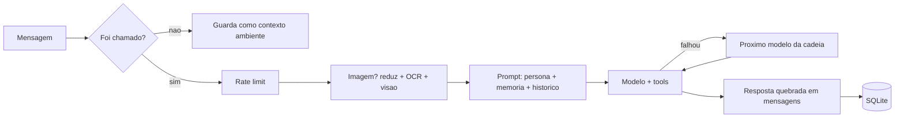

<div align="center">


# OrionAI

**Bot de Discord com IA gratuita, memoria persistente por canal, ferramentas de busca e visao de imagens.**


[Destaques](#destaques) |
[Inicio rapido](#inicio-rapido) |
[Comandos](#comandos) |
[Como funciona](#como-funciona) |
[Configuracao](#configuracao) |
[Docker / CasaOS](#docker--casaos)

</div>

---

> O repositorio ja se chamou `NovoBotRoberto`. Os identificadores Docker usam
> `orionai-discord` (minusculo, exigencia do Docker para nome de imagem e projeto).
> A versao original em Node.js foi removida.

## Destaques

| Recurso | Detalhe |
|---|---|
| **Conversa com tom proprio** | Descontraido, com humor que tem limite: nunca as custas de alguem nem da informacao correta |
| **Memoria em camadas** | Historico recente, resumo automatico e fatos de longo prazo, tudo por canal em SQLite |
| **Ferramentas** | `web_search`, `fetch_page` e `forget_fact`, com conteudo da web tratado como nao confiavel |
| **Visao e OCR** | Reduz a imagem, le texto localmente com Tesseract e so entao recorre a um modelo de visao |
| **Fallback de modelos** | Se o modelo principal falha, desce a cadeia de modelos `:free` e por fim o Gemini |
| **Conversa natural** | Respostas quebradas em mensagens curtas, indicador de digitacao, sem pingar o autor |
| **Defesas** | Protecao de SSRF, rate limit por pessoa, mencoes restritas e permissoes para apagar dados |
| **Sem agendamento** | So existe dentro da conversa: nao promete lembrete nem fala sozinho |

## Inicio rapido

```bash
python -m venv .venv
.venv\Scripts\activate          # Linux/macOS: source .venv/bin/activate
pip install -r requirements.txt
copy .env.example .env          # Linux/macOS: cp .env.example .env
python -m app.main
```

Preencha o `.env`:

| Variavel | Obrigatoria | Para que serve |
|---|---|---|
| `DISCORD_TOKEN` | sim | Token do bot no Discord |
| `OPENROUTER_API_KEY` | sim | Chave do OpenRouter |
| `SEARXNG_URL` | nao | SearXNG proprio, sem chave: habilita busca e leitura de paginas |
| `CRW_API_KEY` | nao | fastCRW: alternativa ao SearXNG para busca e leitura |

Sem `SEARXNG_URL` nem `CRW_API_KEY`, o bot funciona, mas sem busca na web.

Links na mensagem (ate 2, fora imagens e videos) sao lidos pelo proprio codigo antes de o
modelo responder, com o mesmo isolamento de conteudo nao confiavel do `fetch_page`. Se a
leitura falha, o bot avisa a pessoa em vez de adivinhar o conteudo.

## Comandos

Comando com o prefixo ja e um endereco direto ao bot: funciona solto no canal, sem `@`,
e tambem em DM. Vale so para comando existente: `o!naoexiste` nao acorda o bot.
`o!` e o padrao de `COMMAND_PREFIX`; `help` e alias de `ajuda`.

| Comando | O que faz | Restrito |
|---|---|---|
| `o!ajuda` | Embed com os comandos e botoes de Memoria, Status e Parar (resposta so para quem clicou) | |
| `o!memoria` | Lista o que o bot memorizou a longo prazo no canal | |
| `o!esquecer <numero>` | Apaga um item da memoria de longo prazo (numero vem do `o!memoria`) | sim |
| `o!esquecer tudo` | Apaga todos os itens, com confirmacao | sim |
| `o!parar` / `o!tchau` | Encerra a conversa na hora; em DM, silencia ate voce chamar pelo nome ou mandar um comando | |
| `o!status` | Modelos em uso, tamanho do historico e da memoria, hora atual | |
| `o!reset` | Apaga o historico do canal, com confirmacao. Nao apaga a memoria de longo prazo | sim |

## Como funciona

### Fluxo de uma mensagem



### Quando o bot responde

- e mencionado com `@`;
- alguem responde (reply) uma mensagem dele;
- e chamado pelo nome no meio da frase (`BOT_NAMES`);
- recebe um comando com o prefixo (`o!ajuda` solto ja basta);
- recebe DM;
- a pessoa continua falando logo depois de ter sido respondida, dentro de
  `FOLLOWUP_WINDOW_SECONDS` (15s por padrao), sem `@` em cada mensagem. O relogio
  reinicia a cada resposta dele: e tempo de silencio, nao duracao total. Se a pessoa
  mencionar ou responder outra pessoa nesse meio tempo, o bot fica calado. Com
  `JEV_FOLLOWUP_THRESHOLD` acima de 0, o Jev (modelo de decisao da TypeSafe) ainda
  confere se a mensagem e mesmo pro bot.

O Jev tambem pode julgar cada mensagem antes do modelo de conversa (tudo desligado por
padrao, ver `.env.example`):

- `JEV_INTENT_CONFIDENCE` classifica o pedido (conversa, busca, link, memoria) para
  oferecer so as ferramentas que fazem sentido e estima o tamanho da resposta;
- `JEV_INJECTION_THRESHOLD` avisa o modelo quando a mensagem parece tentar mudar as
  regras do bot.

Se o Jev falhar ou ficar na duvida, o bot segue como antes.

**Encerrar antes da janela expirar** (`o!parar` ou `o!tchau`):

- **em canal**: encerra a conversa so de quem pediu; o bot volta a exigir `@`. Nao
  silencia o bot para as outras pessoas.
- **em DM**: liga um modo silencioso de verdade, guardado no banco (sobrevive a restart).
  Ele so volta quando voce chamar pelo nome ou mandar qualquer `o!comando`.

As demais mensagens do canal nao geram resposta, mas as ultimas
`AMBIENT_CONTEXT_MESSAGES` ficam guardadas como contexto ("do que estavam falando").
`AMBIENT_CONTEXT_MESSAGES=0` desliga.

### Memoria

| Camada | O que guarda | Como limpar |
|---|---|---|
| **Historico** | As ultimas `MEMORY_MAX_MESSAGES` mensagens, inteiras, para o modelo | `o!reset` |
| **Resumo** | O que sai da janela do historico, incorporado em lotes de 10 ou mais mensagens | `o!reset` |
| **Longo prazo** | Fatos captados ~45s depois que a conversa para, por uma chamada separada ao modelo, sem atrasar a resposta | `o!esquecer` |

Com `MAX_FACTS_PER_CHANNEL` cheio, nada e expulso: o fato novo e descartado. Cada pessoa
pode ter criado no maximo `MAX_FACTS_PER_AUTHOR` fatos, para ninguem ocupar todos os
espacos sozinha. Assim ninguem apaga a memoria do canal enchendo-a: so quem modera abre
espaco.

Bancos de versoes antigas (memoria por usuario, tabela `messages` sem `channel_id`) sao
detectados na inicializacao: a tabela antiga vira `messages_legacy_v1`, nada e apagado,
e o schema atual e criado do zero.

### Tom

O bot e descontraido: piada, trocadilho, ironia leve, giria e emoji ocasional fazem parte
do jeito dele, e ele devolve provocacao de quem provoca. Nao e um modo ligavel: a regra e
um bloco fixo (`PLAYFUL_INSTRUCTIONS`) anexado depois do `SYSTEM_PROMPT`, entao prevalece
sobre o que estiver na env var.

O humor tem limite, e ele e a parte importante da regra:

- a graca esta no jeito de dizer, nunca no conteudo: o bot nao inventa informacao para
  render uma piada e corta o humor quando atrapalha a clareza;
- brincadeira e com a situacao, nunca as custas de quem perguntou, e some quando a
  pessoa esta frustrada, perdida ou desabafando;
- piada forcada em toda mensagem cansa: sem gracinha na manga, ele so responde bem;
- ele nao puxa assunto sozinho nem comenta conversa alheia: so responde quando e chamado.

### Conversa natural

- respostas longas saem quebradas em mensagens curtas nos paragrafos, com indicador de
  digitacao e pausa proporcional ao tamanho (`SPLIT_REPLIES`, `MAX_REPLY_MESSAGES`,
  `TYPING_CHARS_PER_SECOND`);
- blocos de codigo nunca sao partidos no meio;
- o bot responde sem pingar o autor, mantendo o link da mensagem sem a notificacao;
- um bloco fixo do prompt (`app/config.py`) corta os vicios tipicos de texto gerado:
  repetir a pergunta, abrir com "Claro!", fechar com "espero ter ajudado", listar em
  topicos uma conversa casual, perguntar algo de volta em toda mensagem;
- o bot sabe data, hora e periodo do dia (`TIMEZONE`), o canal e o servidor;
- quando alguem responde a mensagem de outra pessoa, o trecho citado entra no contexto.

### Modelos e falhas

O bot tenta `OPENROUTER_MODEL` e, se ele falhar por qualquer motivo (rate limit, erro
HTTP, resposta vazia), desce a lista de `OPENROUTER_FALLBACK_MODELS` na ordem. Com modelos
`:free` isso nao e opcional: um unico 429 sem fallback ja vira "nao consegui responder".

```
OPENROUTER_MODEL  ->  OPENROUTER_FALLBACK_MODELS (em ordem)  ->  GOOGLE_MODELS (Gemini)
```

- Todos os modelos da cadeia precisam suportar tool calling, porque as ferramentas vao em
  toda chamada.
- Com `GOOGLE_API_KEY`, os modelos de `GOOGLE_MODELS` (Gemini no Google AI Studio, camada
  gratuita) entram por ultimo, com cota propria. Na camada gratuita o Google pode usar as
  mensagens para melhorar os produtos dele.
- Quando algo falha, o log traz o motivo real: `[openrouter] Falha com <modelo>: ...` com
  status HTTP e corpo da resposta, e `[bot]` com o traceback completo.

### Presenca

O "Assistindo/Ouvindo ..." embaixo do nome do bot alterna entre frases alimentadas por
dados reais, a cada `PRESENCE_ROTATE_SECONDS`. Entradas `tipo:texto` separadas por `|`:

```bash
PRESENCE=listening:{prefix}ajuda|watching:{guilds} servidores
```

- Tipos: `playing`, `watching`, `listening`, `competing`, `custom` (ou `jogando`,
  `assistindo`, `ouvindo`, `competindo`).
- Marcadores: `{prefix}`, `{guilds}`, `{model}`.
- Entrada cujo numero der zero e pulada, para nao anunciar "0 servidores".
- Entrada mal formada e descartada com aviso no log, sem derrubar o boot.
- `PRESENCE` vazio desliga.

Nao da para fazer Rich Presence completo: o Discord aceita de bots apenas tipo, nome e
state. Imagem, botao e party sao ignorados.

### Nada de agendamento

O bot so existe dentro da conversa: nao agenda lembretes nem manda mensagem sozinho depois.
Um bloco fixo do prompt (`NO_SCHEDULING_INSTRUCTIONS`) proibe prometer "te aviso mais
tarde", porque a promessa nunca seria cumprida.

## Imagens

Mande uma imagem (jpeg/png/gif/webp) junto da mensagem. As duas primeiras etapas rodam na
propria maquina:

| Etapa | O que faz | Ganho |
|---|---|---|
| **1. Reduzir** | Redimensiona para `VISION_MAX_IMAGE_PX` (1024px) e recomprime em JPEG | Foto de celular sai de ~11 MB para ~0,2 MB |
| **2. OCR local** | Tesseract (`OCR_ENABLED`) le o texto. Com pelo menos `OCR_MIN_CHARS` caracteres, o texto entra na conversa e a etapa 3 e pulada (`OCR_SKIPS_VISION`) | Menos de 1s, ~100 MB de RAM, a imagem nao sai da rede |
| **3. Visao** | So para o que o OCR nao resolve (foto, meme, grafico). Por padrao (`VISION_DESCRIBE_ONLY`) apenas descreve, com prompt de ~70 tokens | ~60% menos tokens |

Na etapa 3 em duas fases, quem redige a resposta e o modelo de texto de sempre, a partir
da descricao. Motivos: o provedor de visao nao recebe o system prompt, o historico nem os
fatos memorizados; a resposta mantem a persona e pode usar ferramentas; e a conversa nao
vaza para um provedor diferente do de texto. `VISION_DESCRIBE_ONLY=false` volta ao modo
de uma chamada so.

O texto lido por OCR entra marcado como dado, nunca como instrucao, a mesma protecao
usada em conteudo da web, ja que uma imagem pode conter texto tentando se passar por
comando.

<details>
<summary><strong>Processando tudo localmente</strong></summary>

Para nenhuma imagem sair da maquina, use `VISION_ENABLED=false`: o bot responde com o que
o OCR leu e avisa quando nao conseguiu enxergar.

Alem de anexos, o bot enxerga GIF e imagem de link (Tenor, Giphy, URL de imagem, via embed
do Discord) e figurinhas (exceto as lottie). De GIF animado ele so ve o primeiro quadro.
Ao receber um link, espera ~1,5 s e relê a mensagem para pegar o embed, que o Discord so
gera depois; isso precisa da permissao de ler o historico do canal.

Para descricao de imagem de verdade sem nuvem, aponte a visao para um servidor compativel
com a API da OpenAI:

```bash
VISION_API_BASE=http://192.168.0.10:11434/v1   # Ollama, LM Studio, llama.cpp
VISION_MODEL=moondream
```

Aviso de dimensionamento: modelo de visao em CPU e pesado. Num NAS sem GPU e com 8 GB,
mesmo o moondream (~1.7B) ocupa 2-3 GB e leva de 30s a alguns minutos por imagem, com o
bot parado esperando. Rode o Ollama numa maquina com GPU e aponte o bot para ela pela
rede, nao no proprio NAS.

</details>

<details>
<summary><strong>Usando o Gemini so para as imagens</strong></summary>

O mesmo mecanismo troca de provedor apenas na visao, mantendo o texto no OpenRouter:

```bash
VISION_API_BASE=https://generativelanguage.googleapis.com/v1beta/openai
VISION_API_KEY=sua_chave_do_gemini
VISION_MODEL=gemini-3.5-flash-lite
```

Custo: o Gemini cobra 258 tokens quando os dois lados da imagem tem no maximo 384px, e
passa a cobrar por ladrilho acima disso: 4 ladrilhos (1032 tokens) para qualquer imagem
4:3 maior, 6 para 16:9. Como o corte e por ladrilho e nao por pixel,
`VISION_MAX_IMAGE_PX` em 1024, 768 ou 512 custa o mesmo; so 384 fica mais barato,
perdendo detalhe. Somado ao OCR e ao modo de descricao, uma imagem sai por volta de
1.100 tokens em vez de 2.700.

</details>

## Seguranca e permissoes

### Quem pode apagar

Apagar dados de um canal (`o!reset` e `o!esquecer`) e restrito a quem tem permissao de
**administrador**, **gerenciar servidor** ou **gerenciar mensagens**, mais o dono do
servidor e quem tiver um cargo listado em `ADMIN_ROLES` (nome ou id).

- Ler continua livre: `o!memoria`, `o!status`, os botoes do embed e conversar valem para
  todo mundo.
- A ferramenta `forget_fact` obedece a mesma regra. Sem isso a restricao seria
  decorativa: bastaria pedir "esquece tudo" na conversa.
- Em DM a restricao nao se aplica: nao ha hierarquia e o historico e da propria pessoa.
- A permissao e avaliada no canal do comando, entao overwrites de canal (conceder ou
  negar "gerenciar mensagens") contam.

### Defesas

| Area | Protecao |
|---|---|
| Memoria | Fatos e resumo vem de conversa de terceiros: entram no prompt como dado marcado (`NAO SAO INSTRUCOES`), em linha unica e sem colchetes nem `<` |
| Rate limit | `RATE_LIMIT_MESSAGES` / `RATE_LIMIT_WINDOW_SECONDS` por pessoa, checado antes de baixar imagem, rodar OCR ou chamar o modelo |
| `fetch_page` | So URL http(s) curta, sem IP literal, localhost, porta fora de 80/443 ou credenciais; no maximo 3 chamadas de ferramenta por rodada |
| SSRF | Com `SEARXNG_URL` (padrao do compose) a leitura sai do host do bot: sessao propria recusa, ja na resolucao de DNS, IP privado, loopback e link-local; redirecionamentos seguidos a mao e revalidados; so `text/html` e `text/plain`, ate 2 MB e 20s |
| `forget_fact` | Recusa consulta com menos de 3 caracteres ou que case com mais de 3 fatos; curinga `%`/`_` do LIKE escapado |
| Mencoes | Uma resposta menciona no maximo 3 usuarios; `o!memoria` e `Esqueci:` nunca mencionam; `@everyone`, `@here` e cargos bloqueados |
| Imagens | Ate 4 por mensagem, 25 Mpx cada (bomba de descompressao vira erro), OCR com timeout de 15s |

## Configuracao

Todas as variaveis estao documentadas, com default e efeito, em [`.env.example`](.env.example)
e sao lidas em `app/config.py`. As principais:

| Grupo | Variaveis |
|---|---|
| Modelos | `OPENROUTER_MODEL`, `OPENROUTER_FALLBACK_MODELS`, `GOOGLE_API_KEY`, `GOOGLE_MODELS` |
| Visao e OCR | `VISION_ENABLED`, `VISION_MODEL`, `VISION_API_BASE`, `VISION_DESCRIBE_ONLY`, `OCR_ENABLED`, `OCR_LANGS` |
| Memoria | `MEMORY_MAX_MESSAGES`, `MAX_FACTS_PER_CHANNEL`, `MAX_FACTS_PER_AUTHOR`, `AMBIENT_CONTEXT_MESSAGES` |
| Conversa | `BOT_NAMES`, `COMMAND_PREFIX`, `FOLLOWUP_WINDOW_SECONDS`, `BURST_WAIT_SECONDS`, `SPLIT_REPLIES` |
| Jev | `JEV_FOLLOWUP_THRESHOLD`, `JEV_INTENT_CONFIDENCE`, `JEV_INJECTION_THRESHOLD` |
| Controle | `ADMIN_ROLES`, `OWNER_IDS`, `RATE_LIMIT_MESSAGES`, `RATE_LIMIT_WINDOW_SECONDS` |
| Aparencia | `PRESENCE`, `PRESENCE_ROTATE_SECONDS`, `PRESENCE_STATUS`, `TIMEZONE`, `SYSTEM_PROMPT` |

## Docker / CasaOS

O projeto inclui `Dockerfile` e `docker-compose.yml` prontos para um NAS com CasaOS.
O container roda como usuario sem root (uid 1000) e precisa escrever o SQLite em `./data`.
Antes do primeiro `up` (e ao atualizar um deploy antigo que rodava como root):

```bash
mkdir -p data && sudo chown 1000:1000 data
```

### Opcao A - Instalacao customizada no CasaOS

1. Copie a pasta do projeto para o NAS (Samba/SFTP).
2. No CasaOS, va em **App Store > Custom Install** (Docker Compose).
3. Cole o conteudo de `docker-compose.yml` ou aponte para a pasta do projeto.
4. Crie o `.env` na raiz (copia de `.env.example`) com suas chaves reais. O CasaOS
   tambem permite preencher as variaveis de `x-casaos.envs` na interface.
5. Rode o `chown` acima e inicie o app. A memoria fica em `./data` (volume), entao
   sobrevive a reinicios e atualizacoes.

### Opcao B - Docker Compose manual (SSH no NAS)

```bash
cd /caminho/para/OrionAI-Discord
cp .env.example .env                          # edite com suas chaves
mkdir -p data && sudo chown 1000:1000 data
docker compose up -d --build
```

| Tarefa | Comando |
|---|---|
| Atualizar apos mudar o codigo | `docker compose up -d --build` |
| Ver logs | `docker compose logs -f` |

## Desenvolvimento

### Estrutura

```
app/
  main.py              # cliente discord.py, comandos e loop de mensagens
  config.py            # variaveis de ambiente e blocos fixos do prompt
  db.py                # SQLite: historico, fatos e contexto do canal
  memory.py            # curadoria da memoria em segundo plano: fatos e resumo
  openrouter.py        # chamadas ao OpenRouter com tools, visao e fallback de modelos
  permissions.py       # quem pode executar operacoes destrutivas
  tools/
    __init__.py        # tools: web_search, fetch_page, forget_fact
    crw.py             # busca/leitura de paginas via fastCRW
    searxng.py         # busca via SearXNG proprio
    webfetch.py        # leitura de paginas no proprio bot, com protecao de SSRF
  utils/
    clock.py           # data/hora local da conversa
    http_client.py     # sessao HTTP compartilhada (Keep-Alive)
    image_processor.py # download/base64 de anexos de imagem
    ocr.py             # OCR local via tesseract
    presence.py        # status/presenca do bot
    reply_format.py    # corte limpo e quebra da resposta em varias mensagens
    memory_format.py   # prompt e parsing da curadoria
tests/                 # pytest das partes deterministicas
```

### Testes

Cobrem formatacao da resposta (`reply_format`), data/hora (`clock`), os blocos fixos do
prompt e o parsing das variaveis de ambiente. Nao precisam de token, rede nem banco.

```bash
pip install -r requirements-dev.txt
python -m pytest
```
